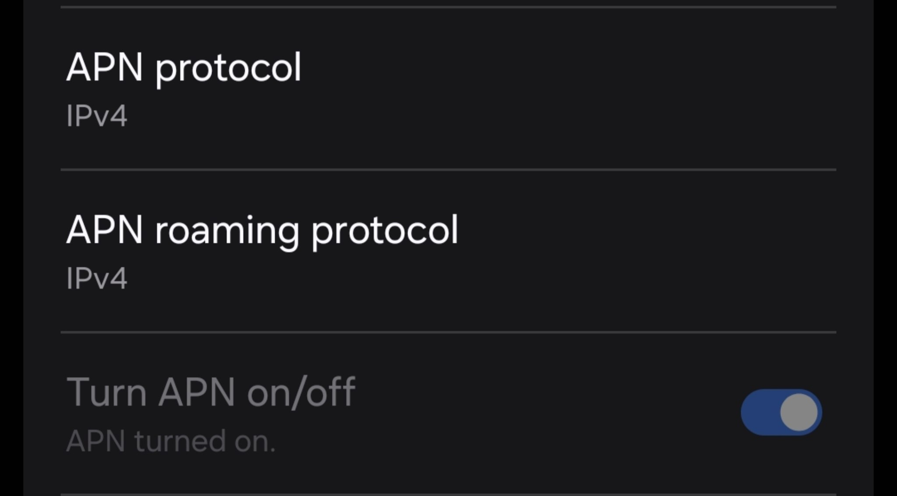

# DYNAMO (Main Repository)

Improved modular computing platform for wearable costumes, with animatronic support, facial/eye tracking, sound processing and mobile network control application.

## Overview

Traditional industry-standard mascot and full-body character suits, although fascinating, face severe limitations regarding expressiveness. These limitations are contoured by either resorting to exhausting body acting skills, or the use of very complex moving parts which require expert handlers, are difficult to transport and assemble, and often cannot be used outside of controlled environments.

The Dynamo project addresses these challenges by introducing an innovative platform for full-body mascot and character suits. Its primary goal is to bring characters to life in real, uncontrolled scenarios by enabling autonomous operation without the need for an external operator. 

## Directory Structure

```
├───Main software
│   ├───models
│   ├───sfx
├───Planning
└───Test scripts
```

- Main software: Python code for the main software of the project with associated artifacts
- Planning: Diagrams and planning documents
- Test scripts: Some scripts used for testing aspects of the project

## Associated Repositories

[Eye Graphics Unity C#](https://github.com/MekhyW/DYNAMO-Eye-Graphics)

[AVR C++ Firmware](https://github.com/MekhyW/DYNAMO-AVR)

[Image processing pipeline](https://github.com/MekhyW/Facial-Emotion-Classification)

[Control App](https://github.com/MekhyW/DYNAMO-Control-App)

[App onboarding](https://github.com/MekhyW/control-app-onboarding)

[Schematics and PCB](https://github.com/MekhyW/DYNAMO-PCB)

## Hardware Assembly


## Software Setup


To setup the project software on a LattePanda Delta 3 board, follow the steps below for required environment and configurations. It should be running Windows 10 and have a stable internet connection.
I also recommend updating to the latest update of Windows 10, and removing any bloat software from the system (such as Cortana, Office 365, etc).

### 1. Install Git Bash and clone this repository

You can download it from [Git for Windows](https://gitforwindows.org/).
Then run the following commands in Git Bash:
```bash
cd C:\Users\LattePanda\Documents\GitHub
git clone https://github.com/MekhyW/DYNAMO-Electronic_Fursuit-2.0
```

### 2. Install Python 3.11

Download and install Python 3.11 from the official [Python website](https://www.python.org/). During installation, make sure to check the option to add Python to the system PATH and include pip.

### 3. Run Setup.bat

```bash
cd C:\Users\LattePanda\Documents\GitHub\DYNAMO-Electronic_Fursuit-2.0
.\Setup.bat
```

### 4. Provide credentials

Create a `.env` file in the root folder of the project's main repository, and use `.env.example` as a reference template.

### 5. Install and Configure Voicemod

Download and install Voicemod V3 from the official [Voicemod website](https://www.voicemod.net/). Install it in the `C:\Program Files` directory. Then log in to your Voicemod account and activate the Pro license if not already activated.

Configure the audio settings, including noise reduction and voice gate. Also, set it to use the default output device. Make sure that the option to auto-start with Windows is checked and it is set to start minimized to the system tray.

To set your own effect options:
- Add the voice effects you want to appear in the app menu as "Favorites"
- For the voices that have background sounds, it is recommended to set them to a low volume (e.g. 10%)
- Add the sound effects you want to appear in the app menu to a soundboard and make their names lowercase

### 6. Install and Configure AnyDesk

Download and install AnyDesk from the official [AnyDesk website](https://anydesk.com/) in the default directory (C:\Program Files (x86)\AnyDesk). 

Open AnyDesk, login/create account and set to connect with password (note down the password), then turn off the option to show notifications for incoming connection requests.
Make sure that the service is set to start automatically.

### 7. Install and Configure Spotify

Download and install Spotify from the official [Spotify website](https://www.spotify.com/download/windows/).

Open Spotify, login/create account (Premium not required but recommended), and make sure that the service is set to start automatically.

### 8. Setup Displays

Set the second display to be an extended display and confirm that both displays are recognized by the system and have the correct resolution.

If a display is recognized but at an incorrect active signal resolution or refresh rate, try using [Custom Resolution Utility (CRU)](https://customresolutionutility.net/) to add a new mode (CVT-RB 800x480@60Hz), then set the video adapter to use this mode.

### 9. Setup 4G/5G Access

To allow the suit to connect to the internet outside of WiFi range, I use 4G/5G tethering from my phone. Make sure that the LattePanda recognizes and remembers the connection, and that it has some layer of authentication security!

Make sure that the Access Point Name (APN) is set to ONLY ipv4. This is important since Telegram servers do not support ipv6 and will not work if the APN is set to ipv4/ipv6.



If you connect to a WiFi network (such as a hotel network), the connection can usually be forwarded to the suit via a "WiFi Sharing" option in the phone's network settings.

### 10. Disable Screen Sleep

Open Settings, go to System > Power & sleep, and then select Never from the drop-down menus under Screen and Sleep for both "On battery power" and "When plugged in" options.

### 11. Disable Volume Ducking

By default, when Windows detects what it thinks is a communications activity (like a VoIP call, or any app that looks like one: Voicemod, Discord, Zoom, etc.), it will automatically reduce the volume of other apps (Spotify, games, etc.) so you can “hear the call.”

We should disable this so that the volume of all sound is not reduced when using the suit.
Go to Control Panel → Sound → Communications tab → Do nothing

## Contributing


Contributions are welcome! Please open an issue or submit a pull request. Or, if you have any suggestions or feedback contact me directly via Telegram @MekhyW.
