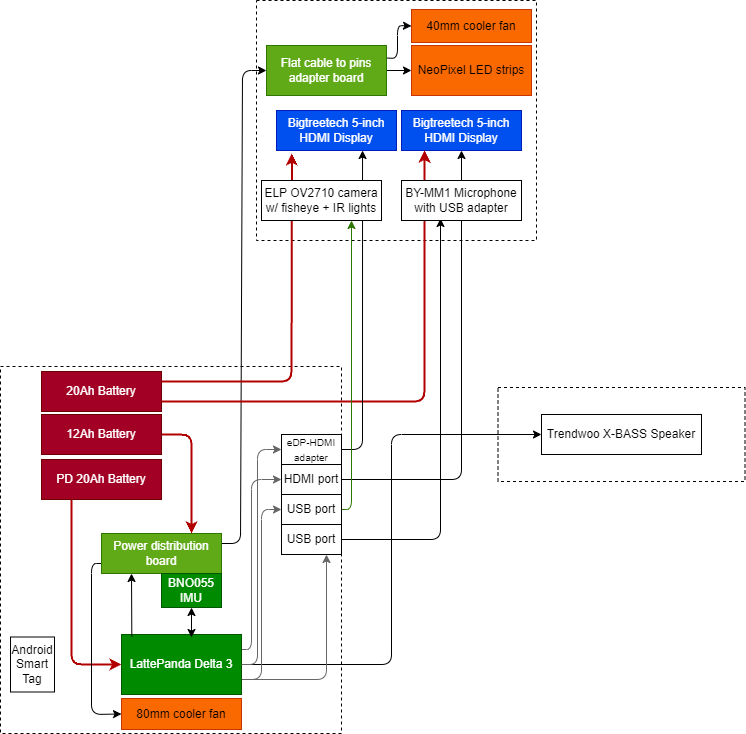

# DYNAMO

Improved modular computing platform for wearable costumes, with animatronic support, facial/eye tracking, sound processing and more

## Overview

Traditional industry-standard mascot and full-body character suits, although fascinating, face severe limitations regarding expressiveness. These limitations are contoured by either resorting to exhausting body acting skills, or the use of very complex moving parts which require expert handlers, are difficult to transport and assemble, and often cannot be used outside of controlled environments.

The Dynamo project addresses these challenges by introducing an innovative platform for full-body mascot and character suits. Its primary goal is to bring characters to life in real, uncontrolled scenarios by enabling autonomous operation without the need for an external operator. 

This is made possible by combining the following key features:

1. Modular Design: The system consists of two main expandable components - a specially designed mask and a component box worn inside a backpack, connected via a wire-joining "vertical spine" structure
2. Advanced Mask Components: The mask incorporates displays, a camera, microphone, servos, and other relevant peripherals to create lifelike expressions and interactions
3. Powerful Processing Unit: A Lattepanda Delta 3 central processing unit housed in the backpack component box serves as the brain of the system
4. Self-Contained Power: Batteries within the component box ensure portability and extended operation
5. Facial/eye-tracking: Custom pipeline for realtime mapping of the wearers gaze and facial expression, which is mirrored on the displayed eyes
6. Audio Processing: A dedicated speaker enables clear voice communication + realtime and non-realtime sound effects
7. Self-Hosted Control Bot: Custom control and debugging interface remotely accessible by the wearer or a third party
8. Assistant Intelligence: Extra layer of interactivity and autonomy with the use of generative AI capable of executing commands and generating responses

## Directory Structure

```
├───AVR_software
├───CAD
│   ├───Electronics
│   ├───Mechanics
│       └───Component box
│       └───Example head
│       └───Mask
│       └───Hinge
├───Logos
├───Main software
│   ├───resources
├───Planning
└───Test scripts
```

- AVR_software: C++ code for the AVR microcontroller responsible for controlling the servos, fan(s) and LEDs of the suit
- CAD: Design files for the components of the project
- Logos: Logos used in the project
- Main software: Python code for the main software of the project. The 'resources' folder contains the machine learning models and other resources used by the software
- Planning: Diagrams and planning documents
- Test scripts: Some scripts used for testing the project

## Hardware Assembly



## Software Setup


To setup the project software on a LattePanda Delta 3 board, follow the steps below for required environment and configurations. It should be running Windows 10 and have a stable internet connection.
I also recommend updating to the latest update of Windows 10, and removing any bloat software from the system (such as Cortana, Office 365, etc).

### 1. Install Git Bash and clone this repository

You can download it from [Git for Windows](https://gitforwindows.org/).
Then run the following commands in Git Bash:
```bash
cd C:\Users\LattePanda\Documents\GitHub
git clone https://github.com/MekhyW/DYNAMO-Electronic_Fursuit-2.0
```

### 2. Install Python 3.11

Download and install Python 3.11 from the official [Python website](https://www.python.org/). During installation, make sure to check the option to add Python to the system PATH and include pip.

### 3. Run Setup.bat

```bash
cd C:\Users\LattePanda\Documents\GitHub\DYNAMO-Electronic_Fursuit-2.0
.\Setup.bat
```

### 4. Provide credentials

Create a `.env` file in the root folder of the project's main repository, with the following contents:

```bash
voicemod_key = "YOUR_VOICEMOD_KEY"
fursuitbot_token = "YOUR_TELEGRAM_BOT_TOKEN"
fursuitbot_ownerID = "YOUR_TELEGRAM_USER_ID"
openai_key = "YOUR_OPENAI_API_KEY"
porcupine_key = "YOUR_PORCUPINE_API_KEY"
```

### 5. Install and Configure Voicemod

Download and install Voicemod from the official [Voicemod website](https://www.voicemod.net/). Install it in the `C:\Program Files` directory. Then log in to your Voicemod account and activate the Pro license if not already activated.

DO NOT use the same account as another device, as it will log out the other device or vice versa!!

Configure the audio settings, including reduction (I recommend leaving at a high value, like 80%) and set it to update without asking. Also, set it to use the default output device. Make sure that the option to auto-start with Windows is checked and it is set to start minimized to the system tray.

The file `voidemod-presets.vs2` contains the presets used for the project. You can import it into Voicemod to use the same settings.

### 6. Install and Configure AnyDesk

Download and install AnyDesk from the official [AnyDesk website](https://anydesk.com/) in the default directory (C:\Program Files (x86)\AnyDesk). 
Open AnyDesk, login/create account and set to connect with password (note down the password), then turn off the option to show notifications for incoming connection requests. Do NOT enable the option to start AnyDesk with Windows, also you don´t need to note down the ID/address as it can be obtained via the control bot.

### 7. Setup Displays

Set the second display to be an extended display and confirm that both displays are recognized by the system and have the correct resolution.

### 8. Setup 4G Module

To allow the suit to connect to the internet outside of WiFi range, I use a 4G LTE Wifi USB modem with a SIM card. Make sure that the LattePanda recognizes the modem and remembers the connection!

In the case of my modem, the IP address is 192.168.100.1, the default username and password are admin/admin, and the default WiFi access point password is 1234567890. Change these settings to your own for security reasons.

Make sure that the Access Point Name (APN) is set to ONLY ipv4. This is important since Telegram servers do not support ipv6 and will not work if the APN is set to ipv4/ipv6. Also, it should contain the username and password of the SIM card, as expected by the carrier.

If possible, use 4G/3G mode instead of just 4G. This is because 4G mode can be unstable in some areas and the system will not be able to connect to the internet.
